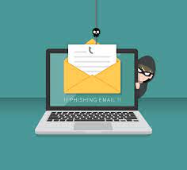

We want to talk to you about a pressing issue that affects many of us - scam emails

Scam emails, or phishing emails, are devious messages sent by cybercriminals who pretend to be someone they're not, with the aim of tricking you into giving them your personal information or money.

Now, we understand that technology can sometimes be confusing, especially for those who didn't grow up with it. But don't worry, we're here to help you protect yourself.

Here are some simple tips to keep in mind when you receive an email that seems suspicious.

1. 📧 "Check the sender's email address. Make sure it matches the official website or organization's domain."
2. 💡 "Look for spelling and grammar mistakes. Scammers often make errors in their emails."
3. 🔒 "Never share personal information, like your Social Security number or bank details, via email."
4. 🤔 "Be cautious of urgent requests for money. Scammers often create a sense of urgency to pressure you."
5. 🚫 "Don't click on links or download attachments from unknown senders."
6. 🧐 "When in doubt, call the organization directly using a trusted phone number, not one provided in the email."

Remember, it's okay to be skeptical. If an email seems fishy, it probably is! 
By following these simple guidelines, you can protect yourself and your loved ones from falling victim to scam emails. 
And don't forget, you're not alone. If you ever have concerns about an email, reach out to a trusted friend or family member for guidance. 

